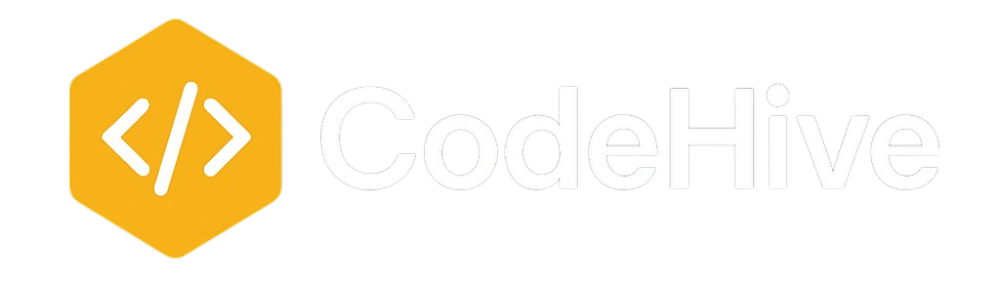
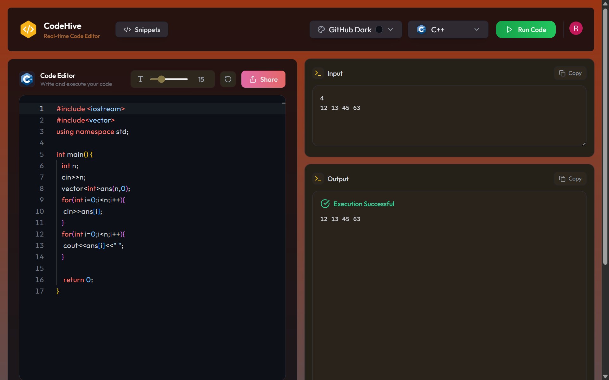
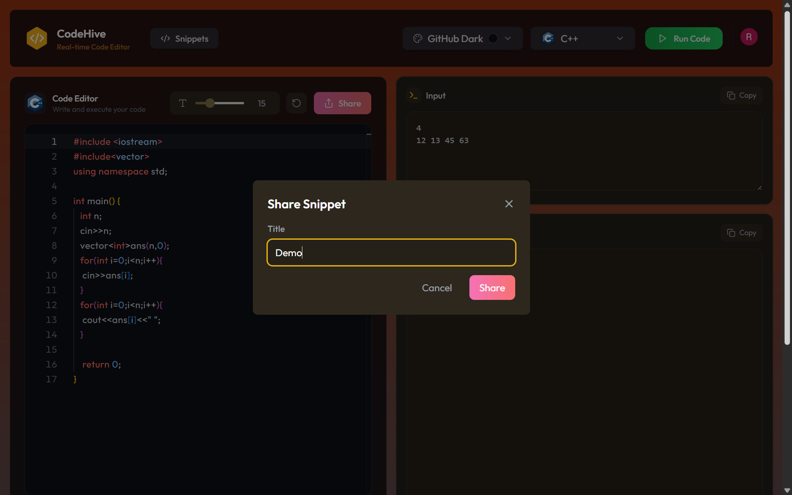
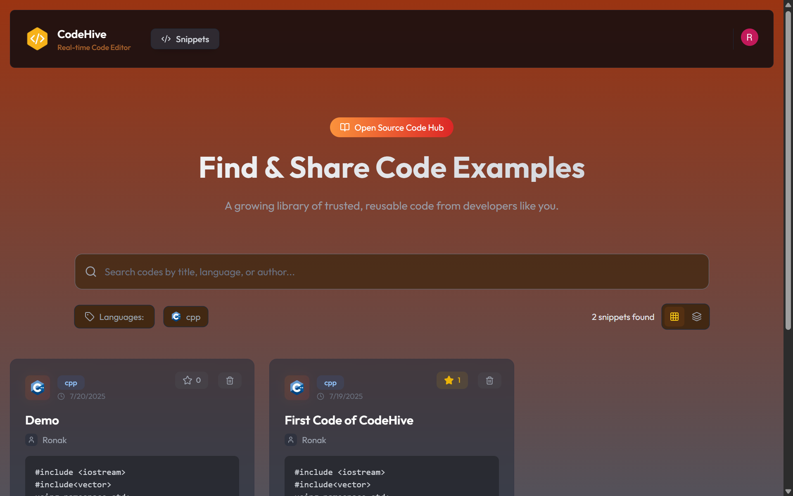
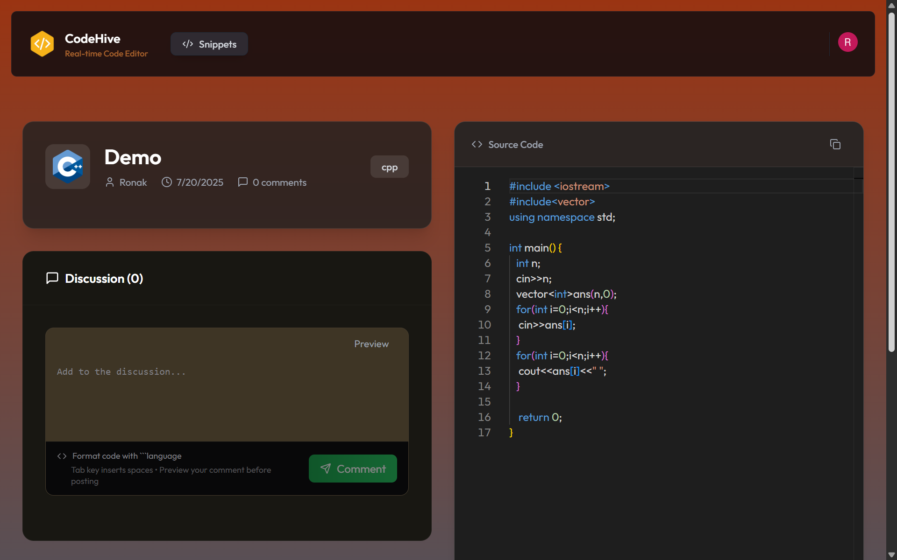
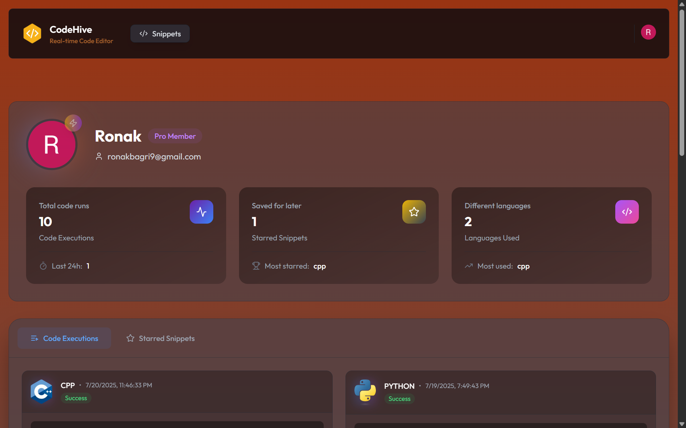
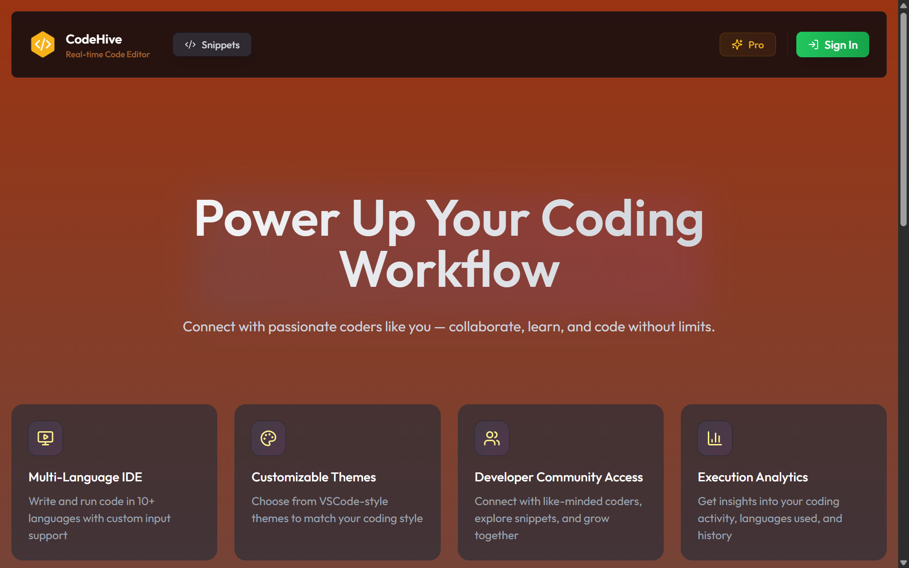

<p align="center">
  
  <h2 align="center"><strong>Where Code Meets Community</strong></h2>
</p>

Welcome to **CodeHive**, an advanced, community-driven online IDE designed for developers and learners to write, run, and share code seamlessly.  

---

## 🖼️ Preview Screenshots

| Page | Preview |
|------|---------|
| **Home Page** |  |
| **Share Snippet ** |  |
| **Snippet Page** |  |
| **Snippet Detail Page** |  |
| **Profile Page** |  |
| **Payment Page** |  |


---

## 🚀 Tech Stack

-  — Powerful React framework for building fast, scalable web applications  
-  — Serverless data storage and real-time backend  
-  — User authentication and account management  
-  — Strongly typed language for better code reliability  
-  — Payment gateway for managing Free & Pro plans  

---

## 🌟 Key Features

### 💻 Online IDE with Multi-Language Support
Write and execute code in **10 different languages**, making it easy to experiment and learn across multiple tech stacks.

### ✍️ Custom Input Support
Users can now provide **custom input** while executing code — enabling dynamic and interactive testing scenarios.

### 🎨 Customizable Developer Experience
Choose from **5 popular VSCode-inspired themes** and adjust font sizes to suit your style.

### ✨ Smart Output Handling
Get clear, intuitive feedback with **Success & Error states**, helping you debug faster and code smarter.

### 💎 Flexible Pricing
Start with the **Free plan** and upgrade to the **Pro plan** for premium features, all powered by LemonSqueezy.

### 🤝 Community-Driven Code Sharing
Share your code snippets publicly, explore what others are building, and contribute to a thriving developer community.

### 🔍 Advanced Search & Filtering
Quickly find projects, snippets, or profiles using powerful filtering and search capabilities.

### 👤 Personal Profile & Execution History
Track all your executed code snippets, maintain your personal coding history, and build your developer portfolio.

### 📊 Comprehensive Statistics Dashboard
Monitor your usage, most-run languages, and code performance metrics through an elegant analytics dashboard.

### ⚙️ Full Customization
Control your coding experience with adjustable **font sizes** and theme settings.

### 🔗 Webhook Integration
Integrate your IDE workflows with external services and automate tasks using webhook support.
---

## 💬 Why CodeHive?

CodeHive isn’t just another online IDE. It’s a **complete coding ecosystem** designed to make development collaborative, customizable, and fun. Whether you’re a beginner exploring new languages or an advanced developer sharing professional snippets, CodeHive empowers you to build and learn without limits.

---


## ✅ Getting Started

Follow these steps to set up the project locally:

### 1. 📦 Clone the Repository

```bash
git clone https://github.com/RONAKBAGRI/CodeHive
cd codehive
```

### 2. 📁 Install Dependencies

```bash
npm install
```

### 3. ⚙️ Set Environment Variables
Create a .env.local file in the root directory and configure the following:

```bash
NEXT_PUBLIC_CLERK_PUBLISHABLE_KEY=your_clerk_publishable_key
CLERK_SECRET_KEY=your_clerk_secret_key

CONVEX_DEPLOYMENT=your_convex_deployment_url
NEXT_PUBLIC_CONVEX_URL=your_convex_project_url

CLERK_WEBHOOK_SECRET=your_clerk_webhook_secret
LEMON_SQUEEZY_WEBHOOK_SECRET=your_lemonsqueezy_webhook_secret

NEXT_PUBLIC_PISTON_API_BASE_URL=https://emkc.org/api/v2/piston

NEXT_PUBLIC_APP_URL=http://localhost:3000

NEXT_PUBLIC_LEMONSQUEEZY_STORE_ID=your_lemonsqueezy_store_id
NEXT_PUBLIC_LEMONSQUEEZY_API_KEY=your_lemonsqueezy_api_key
```
### 4. 🧠 Set Up Convex
Login to Convex . Then start the Convex dev server in a separate terminal:
```bash
npx convex dev
```

### 5. Run the App
```bash
npm run dev
```
---

## 🙌 Contributing

Community contributions are at the heart of CodeHive.  
Once we open-source, we welcome PRs, ideas, and feature requests to make this platform even better.

---

---

## 🌐 Links

- 🌟 [Visit Our Website](https://code-hive-by-ronak.vercel.app/) — Live!

---

### 🚀 Let’s code the future, together!
