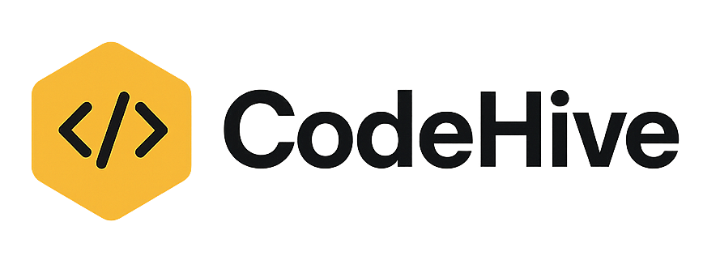

  
  <h2 align="center"><strong>The Future of Online Coding</strong></h2>

Welcome to **CodeHive**, an advanced, community-driven online IDE designed for developers and learners to write, run, and share code seamlessly.  

## 🚀 Tech Stack

- **Next.js 15** — Powerful React framework for building fast, scalable web applications
- **Convex** — Serverless data storage and real-time backend
- **Clerk** — User authentication and account management
- **TypeScript** — Strongly typed language for better code reliability
- **LemonSqueezy** — Payment gateway for managing Free & Pro plans

---

## 🌟 Key Features

### 💻 Online IDE with Multi-Language Support
Write and execute code in **10 different languages**, making it easy to experiment and learn across multiple tech stacks.

### 🎨 Customizable Developer Experience
Choose from **5 popular VSCode-inspired themes** and adjust font sizes to suit your style.

### ✨ Smart Output Handling
Get clear, intuitive feedback with **Success & Error states**, helping you debug faster and code smarter.

### 💎 Flexible Pricing
Start with the **Free plan** and upgrade to the **Pro plan** for premium features, all powered by LemonSqueezy.

### 🤝 Community-Driven Code Sharing
Share your code snippets publicly, explore what others are building, and contribute to a thriving developer community.

### 🔍 Advanced Search & Filtering
Quickly find projects, snippets, or profiles using powerful filtering and search capabilities.

### 👤 Personal Profile & Execution History
Track all your executed code snippets, maintain your personal coding history, and build your developer portfolio.

### 📊 Comprehensive Statistics Dashboard
Monitor your usage, most-run languages, and code performance metrics through an elegant analytics dashboard.

### ⚙️ Full Customization
Control your coding experience with adjustable **font sizes** and theme settings.

### 🔗 Webhook Integration
Integrate your IDE workflows with external services and automate tasks using webhook support.

### 🌟 Professional Deployment Walkthrough
Detailed, step-by-step deployment guide so you can understand the full deployment process and replicate it yourself.

---

## 💬 Why CodeHive?

CodeHive isn’t just another online IDE. It’s a **complete coding ecosystem** designed to make development collaborative, customizable, and fun. Whether you’re a beginner exploring new languages or an advanced developer sharing professional snippets, CodeHive empowers you to build and learn without limits.

---

## ✅ Getting Started

Stay tuned! The project is currently under active development.  
✨ A detailed installation and usage guide will be added soon.

---

## 🙌 Contributing

Community contributions are at the heart of CodeHive. Once we open-source, we welcome PRs, ideas, and feature requests to make this platform even better.

---

## 💡 License

This project will be licensed soon. Check back for updates!

---

## 🌐 Links

- 🌟 [Visit Our Website](#) — Coming Soon!
- 💬 [Join the Community](#) — Discord/Slack invite coming soon

---

### 🚀 Let’s code the future, together!

---

